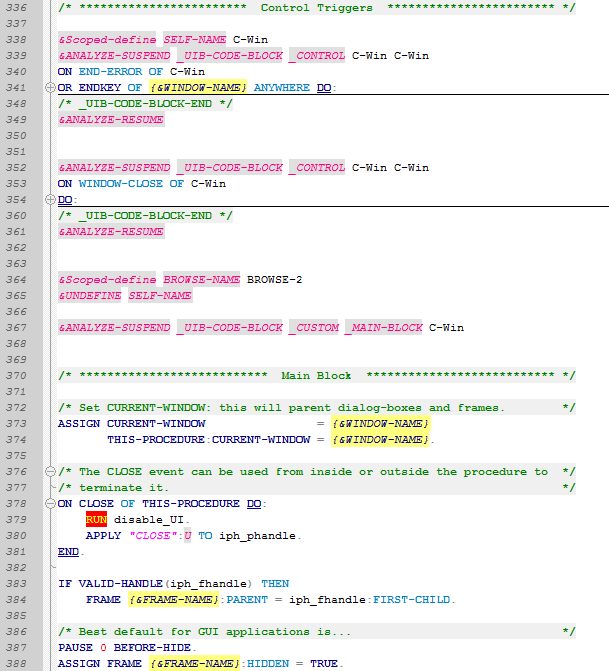
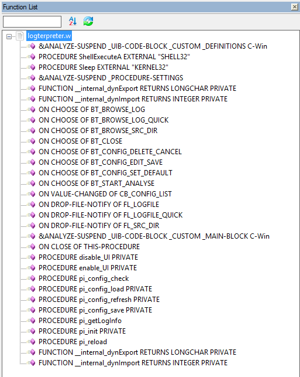

Progress ABL for Notepad++
==========================

Syntax highlighting and functions listing for [Progress ABL](https://www.progress.com/openedge) files in [Notepad++](http://notepad-plus-plus.org/ "Notepad++ Home Page").

Description
-----------
This is NOT a plugin ; only configuration for use with Notepad++.
There are 2 Notepad++ customized features in this repository:

1.
A ready-to-import XML file that gives syntax highlighting/coloring for .p .w .i and .cls files and brings ability to fold code structure.
A recent version of Notepad++ is required (one of those supporting the [User Defined Language](http://udl20.weebly.com/ "User Defined Language")).

2.
An XML delta-file to make Notepad++ able to detect Progress ABL functions, procedures, external procedures, event triggers and even AppBuilder sections.

Syntax highlighter features
---------------------------
- keywords (many ABL keywords are recognized and classified in statements and methods/properties)
- comments
- nested comments (yes, Progress can do this)
- strings
- numbers
- preprocessor directives
- outlining of blocks like DO, PROCEDURE, FUNCTION

Functions list features
-----------------------
- detection of internal procedures
- detection of external procedures (such as functions in .so or .dll)
- detection of functions and function forwards
- detection of triggers
- detection of definition sections
- detection of main block sections
- detection of procedure settings sections

How to use the syntax highlighter
---------------------------------
 - download the `udl-progressabl-classic.xml` file
 - open Notepad++
 - go to  `Language -> Define your language...`,  click on  `Import...` and select the `udl-progressabl-classic.xml` file you've downloaded
 - close and restart Notepad++
 - finished :)

How to use the syntax highlighter with theme
--------------------------------------------
 - download the `udl-progressabl-solarized.xml` file
 - open Notepad++ and import this user defined language
 - enable "Solarized" theme (via menu Settings --> Style configurator)
 - manually select the language "Progress ABL (solarized)"
 - finished :)

How to use the function-list configuration
------------------------------------------
 - download the `functionlist-delta.xml` file
 - close all instances of Notepad++
 - go to settings directory of Notepad++ (can be either %APPDATA% or installation directory, according to the presence of `doLocalConf.xml`)
 - open `functionlist.xml` and manually merge `functionlist-delta.xml` in it (sorry, I don't know any other way to do this) - don't use Notepad++ to do this or you might lose your changes
 - delete `functionlist-delta.xml` as it is no longer necessary
 - finished :)

Notes
-----
 - the color scheme is built for the default theme (white background)
 - some keywords are missing and are planed to be added on the fly

Previews
--------

### Syntax highlighter

### Functions List

If you want more
----------------
Give a try to the excellent ["Progress Programmers Pal" (a.k.a. "3P")](https://jcaillon.github.io/3P/ "3P Home Page") plugin.

And now...
----------
Enjoy!
